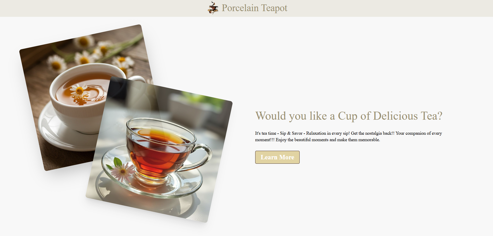

<h1 align="center">🍵 Porcelain Tea</h1>

  A modern tea shop management platform — explore, add, update, and manage teas with a clean interface and smooth animations.

  
  
  
  
  
  
  
  
  
  

---

## 🧾 Overview

**Porcelain Tea** is a full-stack tea shop management web application where users can browse teas, add new teas, update information, or delete them.  
The **frontend** is built with **React, Tailwind CSS, DaisyUI, and Framer Motion** for smooth animations.  
The **backend** is built with **Node.js, Express.js, and MongoDB**, deployed on **Vercel**, while the frontend is deployed on **Firebase**.

---

## ✨ Key Features

- 🍵 **Tea Management**
  - **Home Page:** Displays all tea cards with details.  
  - **Add Tea:** Click on "Add Tea" to navigate to the add-tea page. Upon success, a SweetAlert2 success modal appears, or an error modal if something goes wrong.  
  - **Update Tea:** Edit tea details by clicking the **pen icon**.  
  - **Delete Tea:** Clicking the **delete button** triggers a SweetAlert2 confirmation modal. Once confirmed, the tea gets deleted.

- 🔍 **Tea Details View**  
  - Click on the **eye button** on a tea card to see detailed information about that tea.

- 🎉 **Interactive Alerts**  
  - SweetAlert2 modals for success, error, or confirmation messages (Add, Update, Delete).

- 🎨 **Smooth Animations**  
  - Hero section and various elements animated using **Framer Motion**.

- 📷 **Social Media Gallery**  
  - Instagram-style image grid for showcasing tea-related photos.

- 🦶 **Footer Section**  
  - Contains brand info and social media links.

---

## 📸 Preview

---

## 🔧 Tech Stack

| Technology    | Purpose |
|---------------|---------|
| **HTML5**     | Semantic page structure |
| **Tailwind CSS** | Utility-first responsive design |
| **DaisyUI**   | Pre-styled Tailwind components |
| **React**     | Component-based frontend |
| **React Router**     | Navigation & route management |
| **Framer Motion** | Smooth animations |
| **SweetAlert2** | Success/Error/Confirmation modals |
| **React Icons** | Icon library |
| **ImageBB**   | Image hosting for tea photos |
| **Node.js**   | Backend runtime |
| **Express.js** | Backend API |
| **MongoDB**   | Database for teas |
| **Render**    | Backend deployment |
| **Firebase Hosting** | Frontend deployment |

---

## 🚦 How It Works

1. **Home Page:** Browse teas displayed as cards with options for view, edit, or delete.  
2. **Add Tea:** Add new tea via a form. SweetAlert2 modal confirms success or failure.  
3. **Tea Details:** Click the **eye icon** to see full details of any tea.  
4. **Update Tea:** Click the **pen icon** to edit tea info and save changes.  
5. **Delete Tea:** Click the **delete button** to confirm and remove a tea.  
6. **Social Media & Footer:** Explore Instagram-style photos and footer links.

---

## 🚀 Deployment
- **Frontend:** Deployed on [Firebase Hosting](https://firebase.google.com/products/hosting).  
- **Backend:** Deployed on [Render](https://render.com/)
